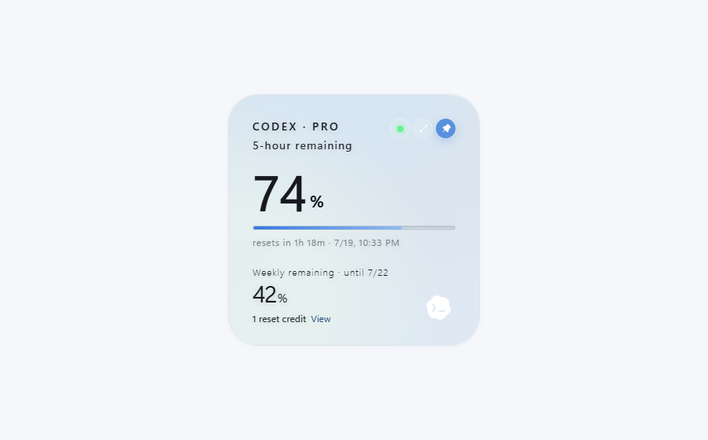
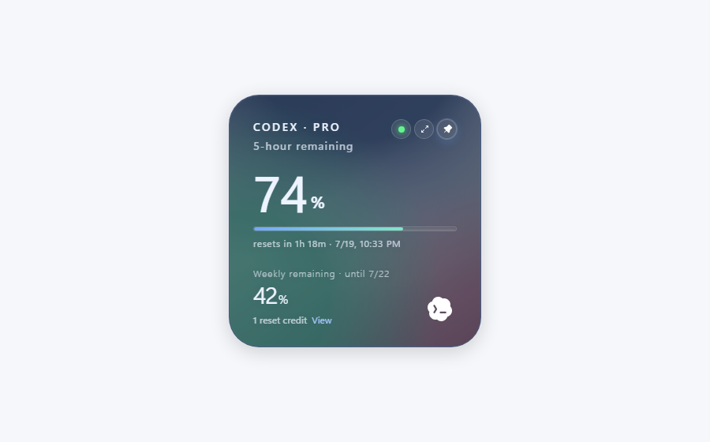
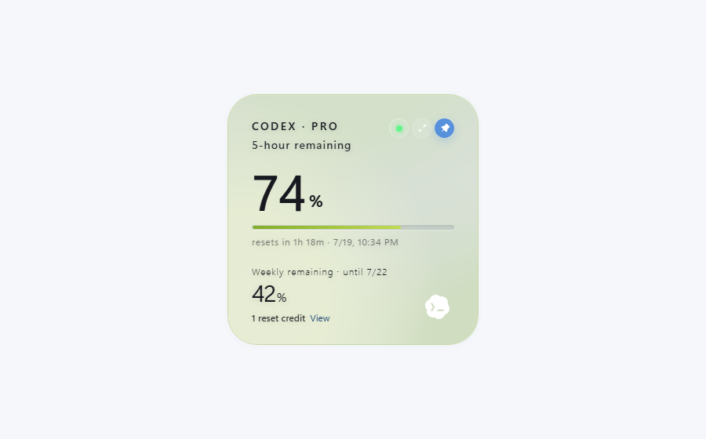
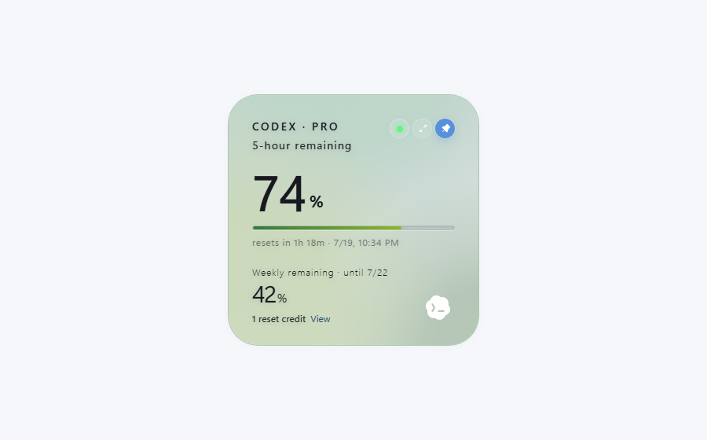
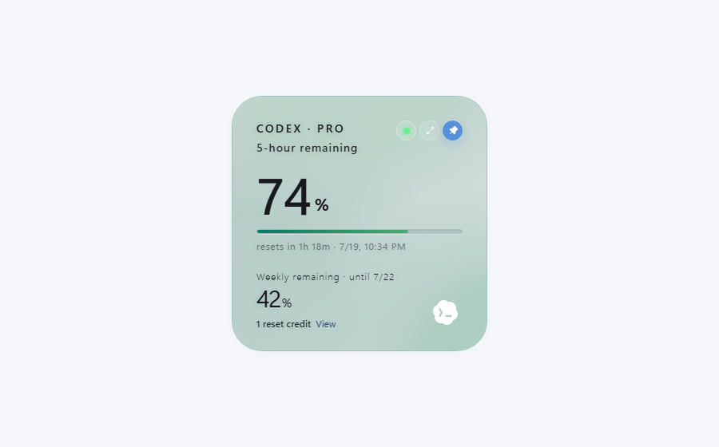
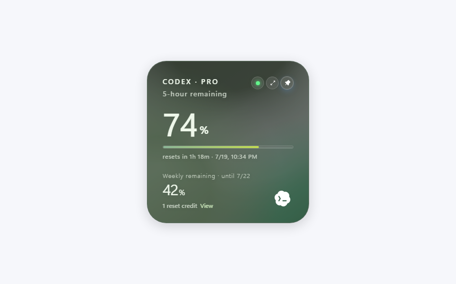
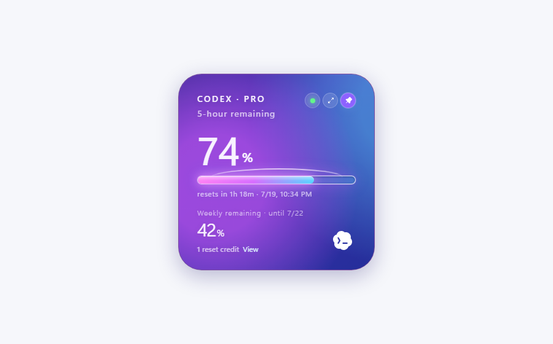
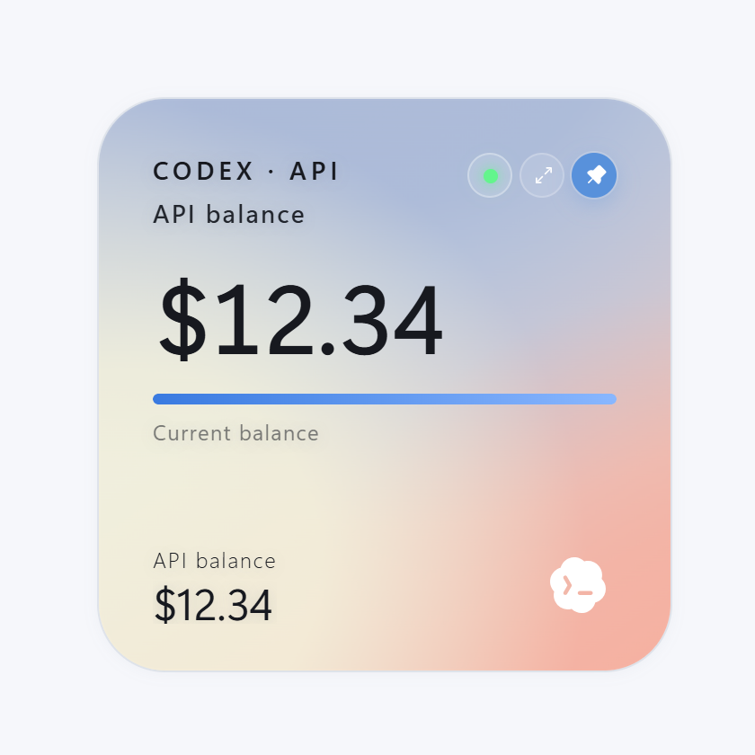

# quota-float-Pro

`quota-float-Pro` 是基于 [change-42-yhmm/quota-float](https://github.com/change-42-yhmm/quota-float) 的二次开发版本。原项目提供 Codex 官方账号额度悬浮窗，本项目在保留原有官方账号额度读取能力的基础上，增加了 API/第三方兼容平台余额监督、主题系统和更完整的桌面端交互。

> 本项目只用于本机监督 Codex 额度/余额用量，提示额度大概什么时候会用完；不会保存 API Key、Cookie、账号数据、原始接口响应、提示词或聊天记录。

## 二改新增功能

- 保留官方 Codex 登录态额度读取：继续显示官方账号的 5 小时额度、本周额度、重置时间和重置机会。
- 增加 API 登录识别：当检测到 API/第三方兼容接口登录时，自动切换到余额展示，不再误提示 Codex 未登录。
- 兼容 CC Switch：可读取当前 Codex provider、真实 base URL、Usage Query、余额接口和本地 provider 配置。
- 兼容 Codex++：支持读取 `~/.codex-session-delete/settings.json` 的当前 relay 配置，以及激活 profile 中的 `authContents` / `configContents`。
- 支持第三方 USD 余额接口：自动探测常见余额路径，包括 `/v1/usage`、`/usage`、`/balance`、`/credits` 等。
- API 余额只显示 USD：不会用请求次数、daily usage 或非余额字段冒充余额。
- API 进度条按本机余额高水位计算：当前余额作为 100%，余额下降时进度同步下降，续费增加后重新回到 100%。
- 新增主题设置窗口：托盘菜单点击“主题”打开独立设置窗口，可切换主题、置顶、常态展开、轮播速度和进度条样式。
- 新增 7 套主题：极光、深色、青瓷、竹绿、孔雀绿、绿云、星河。
- 新增连续/分段进度条：分段进度条固定 5 段，并适配当前主题色。
- 优化悬浮窗交互：圆球/展开动画更顺滑，修复圆球变长方形、鼠标移入闪动、非默认主题灰色外圈等问题。

## 主题预览

| 极光 | 深色 |
| --- | --- |
|  |  |

| 青瓷 | 竹绿 |
| --- | --- |
|  |  |

| 孔雀绿 | 绿云 |
| --- | --- |
|  |  |

| 星河 |
| --- |
|  |

## 界面示例

| 官方账号额度 | API 余额 | 圆球模式 |
| --- | --- | --- |
|  |  |  |

## 支持的数据来源

- Codex Desktop 官方登录态：通过本机 Codex/Codex Desktop 登录状态读取官方额度。
- OpenAI API 或 OpenAI-compatible API：读取配置中的 `base_url`、`experimental_bearer_token`、`OPENAI_API_KEY` 或 auth 文件。
- CC Switch：读取当前 Codex provider 和 Usage Query 配置。
- Codex++：读取当前 relay/API 配置，切换 API 后下次刷新会重新识别。

如果第三方服务没有暴露可识别的 USD 余额接口，小组件会提示“已连接 API，但没有检测到可用的 USD 余额字段”，不会编造余额。

## 隐私边界

- 不保存 API Key、Codex token、Cookie、验证码或账号资料。
- 不保存原始额度响应、请求日志、提示词或聊天内容。
- 只保存小组件偏好设置和本机余额高水位基线，用于进度条计算。
- 余额接口请求只在本机配置的官方或第三方 API 地址上发起。
- 不包含遥测、统计、崩溃上报或第三方追踪。
- 不会兑换重置机会，也不会修改账号设置。

## 开发

环境要求：

- Node.js 20+
- Rust stable
- Tauri 2 桌面端依赖

```bash
npm install
npm test
npm run build
npm run tauri dev
```

Codex Desktop 更新后，可运行兼容性检查：

```bash
npm run check:codex
```

## 构建

```bash
npm run tauri build
```

Windows 下 Tauri 可能会下载 WiX 用于生成 MSI。如果 WiX 下载失败，release exe 仍可能生成在：

```text
src-tauri/target/release/quota-float.exe
```

## 上游项目

- 上游项目：[change-42-yhmm/quota-float](https://github.com/change-42-yhmm/quota-float)
- 本项目为二次开发版本，感谢原作者提供的 Codex 额度悬浮窗基础实现。

## License

MIT
